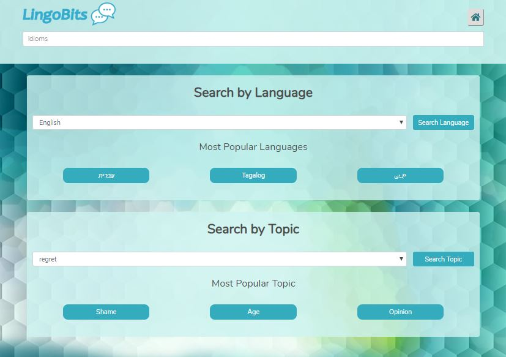

# Idicombs

Idicombs (a.k.a LingoBits) an application to connect people through language and bridge cultural differences by utilizing a unique idiom search engine with the added feature of linking idioms to their equivalents in other languages.

This is a passion project of mine that started as a group project with [**Sherif H. Mahmoud**](https://github.com/sherifmahmoud), [**Haddassah Mendoza-Elias**](https://github.com/haddassah) and [**Ellen Baccera**](https://github.com/ebacerra?tab=repositories). You can check out the first version of this website [here](https://github.com/erandro/LingoBits).

## Version

2.0.0.


## Installation

### Clone

- Clone this repo to your local machine. 

### Setup

> on your terminal go to the root and install the package first

```shell
$ npm install
```
> then you can run the app on your localhost

```shell
$ node server.js
```

## Deployment

* [Heroku](https://vast-waters-75039.herokuapp.com/)

## Authors

* **Eran Dromy** - [GitHub](https://github.com/erandro)

## Acknowledgments

* Michael Doherty
* Poornima Sewak
* Nelly Sugu